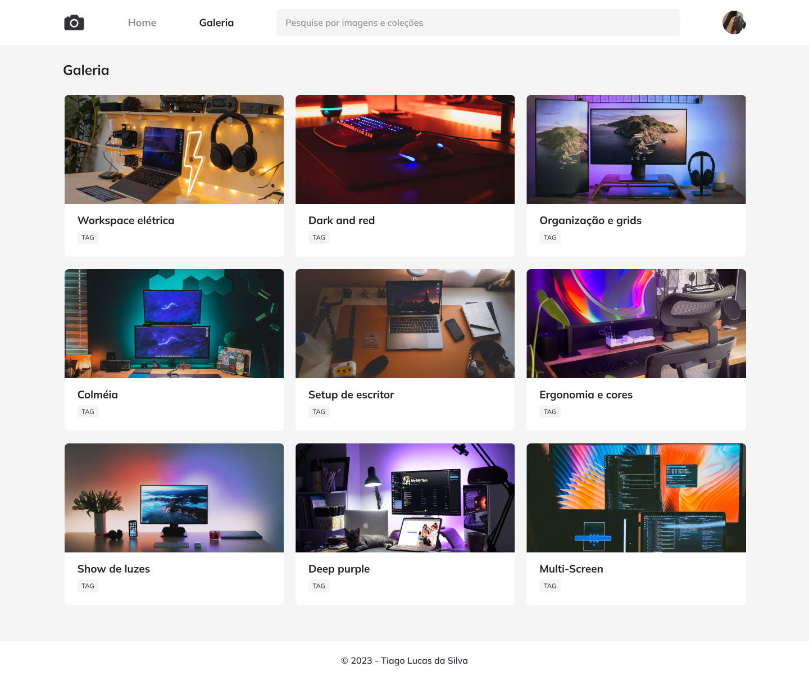

## 💻 Projeto

# Fotoblog

 Esse projeto de galeria de fotos utilizando uma API para que as fotos sempre sejam diferentes

 

  
  

  ## 📝 Licença

Esse projeto está sob a licença MIT. Veja o arquivo [LICENSE](LICENSE) para mais detalhes.
